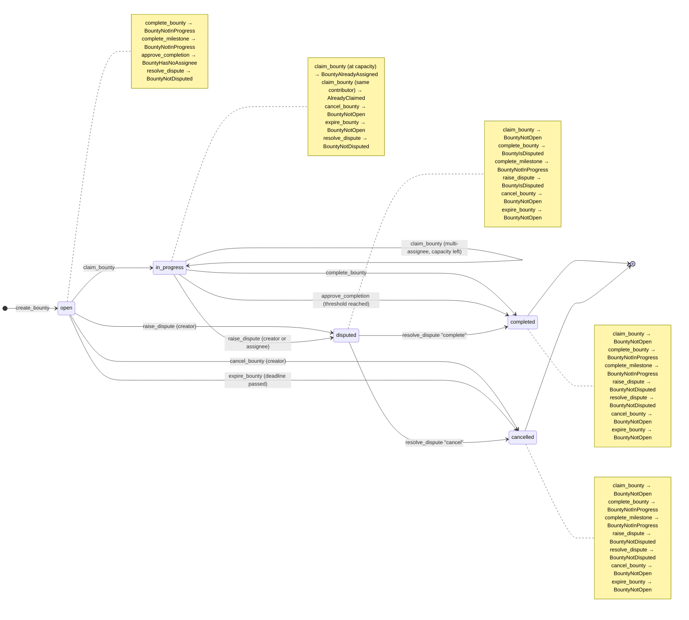

# Contract Architecture

## Two Contract Codebases: Soroban (Rust) vs. Solidity

This repository contains contract code for **two different chains**. A new
contributor browsing the tree will find both `src/contract/` (Rust) and
`contracts/bounty/` (Solidity) and could reasonably assume only one is
actually live. This section clarifies the relationship and current status
of each.

| | `src/contract/` | `contracts/bounty/` |
|---|---|---|
| Language | Rust (`#[contracttype]`, `#[contractimpl]`) | Solidity `^0.8.0` |
| Target chain | Stellar, via the Soroban VM | EVM-compatible chains |
| Role | **Primary contract.** Owns bounty creation, claiming, completion, cancellation, and expiry — the full lifecycle documented below. | Standalone batch-refresh utility (`BountyRefresh.sol`) that calls out to an external `IBountyManager` to bulk-update contributor metrics. It does not create, claim, or pay out bounties itself. |
| Status | **Live / actively developed.** This is the contract MergeMint deploys and the one the rest of this document (data flow, state machine, storage/TTL) describes. | **Not deployed.** No `hardhat.config.*` exists in this repo yet, and `IBountyManager` has no production implementation — only the `MockBountyManager` test double under `test/bounty/mocks/`. Treat it as an EVM-side prototype/utility contract, exercised solely by its own Hardhat test suite (`test/bounty/BountyRefresh.test.js`). |
| Build/test tooling | `cargo build` / `cargo test` (see [CONTRIBUTING.md](../CONTRIBUTING.md)) | `npx hardhat test` |

**Why both exist:** MergeMint's production bounty logic lives on Stellar
via Soroban (`src/contract/`). The Solidity code under `contracts/bounty/`
was added to explore a companion, permissioned batch-refresh mechanism for
a possible future EVM-side integration (e.g. syncing contributor metrics
into an EVM-based `IBountyManager`). It is intentionally decoupled from the
Soroban contract — the two do not call each other and do not share state.

If you're modifying bounty *lifecycle* behavior (create/claim/complete/
cancel/expire), you want `src/contract/`. If you're modifying the
EVM-side batch refresh mechanism or its mock/test harness, you want
`contracts/bounty/` and `test/bounty/`.

---

## Module Layout

`MergeMintContract` lives in `src/contract/` as a directory module rather than a
single file. `mod.rs` declares the `#[contract]` struct and pulls the other
files in via `include!`, so all three still compile as one `impl` block:

```
src/contract/
├── mod.rs           — contract struct definition; include!()s the files below
├── mutations.rs      — state-changing entry points (create_bounty, claim_bounty,
│                       complete_milestone, complete_bounty, approve_completion,
│                       raise_dispute, resolve_dispute, update_contributor_metadata,
│                       cancel_bounty, expire_bounty)
├── queries.rs         — read-only entry points (get_bounty, get_contributor,
│                       get_bounty_count, get_bounties_by_status, get_status_count,
│                       get_open_bounties, get_bounties_by_tag,
│                       get_contributor_active_bounty, get_bounties_by_creator, ...)
│                       plus the shared `paginate()` helper
└── queries_test.rs    — unit tests for the query helpers (`mod tests`)
```

## Data Flow

```
User (Frontend)
    │
    ▼
MergeMintContract (src/contract/mod.rs)
    │
    ├── mutations.rs
    │   ├── create_bounty()
    │   │   ├── Validates creator auth
    │   │   ├── Stores bounty in persistent storage
    │   │   └── Emits bounty_created event
    │   │
    │   ├── claim_bounty()
    │   │   ├── Validates contributor auth
    │   │   ├── Assigns contributor to bounty
    │   │   └── Emits bounty_claimed event
    │   │
    │   ├── complete_bounty()
    │   │   ├── Validates verifier auth
    │   │   ├── Transfers tokens via TokenClient
    │   │   ├── Updates contributor reputation
    │   │   ├── Emits bounty_completed event
    │   │   └── Emits reward_paid event
    │   │
    │   ├── cancel_bounty()
    │   │   ├── Validates creator auth
    │   │   ├── Sets status to "cancelled"
    │   │   └── Emits bounty_cancelled event
    │   │
    │   └── expire_bounty()
    │       ├── Validates caller auth (permissionless)
    │       ├── Checks deadline has passed
    │       ├── Sets status to "cancelled"
    │       └── Emits bounty_expired event
    │
    └── queries.rs
        └── get_bounty(), get_contributor(), get_bounty_count(),
            get_bounties_by_status(), get_status_count(),
            get_open_bounties(), get_bounties_by_tag(), ... (read-only,
            no auth, no storage writes)
```

## Storage Layout

- `bounty_count` — u64 counter
- `bounty_{id}` — Bounty struct
- `contributor_{address}` — Contributor struct

## Events

| Event | Topics | Data |
|-------|--------|------|
| bounty_created | (Symbol, creator) | (bounty_id, reward) |
| bounty_claimed | (Symbol, contributor) | bounty_id |
| bounty_completed | (Symbol, contributor) | bounty_id |
| reward_paid | (Symbol, contributor) | (bounty_id, amount) |
| bounty_cancelled | (Symbol, creator) | bounty_id |
| bounty_expired | (Symbol, creator) | bounty_id |

---

## Bounty Lifecycle State Machine

### States

| State | Description |
|-------|-------------|
| `open` | Bounty is available for contributors to claim. |
| `in_progress` | A contributor has claimed the bounty and is working on it. |
| `completed` | The bounty has been verified and the reward has been paid out. |
| `disputed` | The creator or an assignee raised a dispute. Only `resolve_dispute` can move it on. |
| `cancelled` | The bounty was cancelled by its creator, expired after its deadline passed, or a dispute was resolved with `"cancel"`. |

> **Note:** The Mermaid diagram below provides the comprehensive machine, including dispute transitions and the exact errors returned for every invalid transition.

---

### State Transition Diagram (Mermaid)

The diagram below is the single source of truth for status transitions accepted by the contract. Solid arrows depict valid transitions, annotated with the triggering entry point. The note for each state lists invalid transitions attempted from that state along with the resulting `ContractError`.



---

### Invalid Transition Reference Table

The table below lists the error returned when a given entry point is executed on a bounty in each respective lifecycle status.

| Entry point | `open` | `in_progress` | `disputed` | `completed` | `cancelled` |
|---|---|---|---|---|---|
| `claim_bounty` | Accepted | Accepted if `assignees.len() < max_assignees`, else `BountyAlreadyAssigned` | `BountyNotOpen` | `BountyNotOpen` | `BountyNotOpen` |
| `complete_bounty` | `BountyNotInProgress` | Accepted | `BountyIsDisputed` | `BountyNotInProgress` | `BountyNotInProgress` |
| `complete_milestone` ¹ | `BountyNotInProgress` | Accepted | `BountyNotInProgress` | `BountyNotInProgress` | `BountyNotInProgress` |
| `approve_completion` ² | `BountyHasNoAssignee` | Accepted | Evaluated by verifier list | Evaluated by verifier list | Evaluated by verifier list |
| `raise_dispute` | Accepted | Accepted | `BountyIsDisputed` | `BountyNotDisputed` ³ | `BountyNotDisputed` ³ |
| `resolve_dispute` | `BountyNotDisputed` | `BountyNotDisputed` | Accepted | `BountyNotDisputed` | `BountyNotDisputed` |
| `cancel_bounty` | Accepted | `BountyNotOpen` | `BountyNotOpen` | `BountyNotOpen` | `BountyNotOpen` |
| `expire_bounty` | Accepted | `BountyNotOpen` | `BountyNotOpen` | `BountyNotOpen` | `BountyNotOpen` |

Notes:
1. `complete_milestone` never mutates `status`. It marks a specific milestone completed and pays out its reward. It is gated on `in_progress`.
2. `approve_completion` does not contain an explicit standalone status guard when `required_verifiers` is `Some`. If `required_verifiers` is `None`, it falls back to `complete_bounty_inner` which requires `in_progress` (`BountyNotInProgress`).
3. `raise_dispute` on terminal bounties (`completed`, `cancelled`) fails with `BountyNotDisputed` (`"bounty is not in disputed status"`).

### Guard Evaluation Precedence

When multiple validation preconditions fail simultaneously, the first evaluated guard returns:
- `claim_bounty`: `BountyNotFound` → `AlreadyClaimed` → `BountyNotOpen` → `CreatorCannotClaim` → `BountyAlreadyAssigned` → `ContributorHasActiveClaim` → `BountyDeadlinePassed` → `ReputationTooLow`.
- `complete_bounty`: `BountyNotFound` → `BountyIsDisputed` → `BountyNotInProgress` → `BountyHasNoAssignee` → `VerifierCannotBeAssignee` (→ `NotAllMilestonesCompleted` for milestone bounties).
- `raise_dispute`: `BountyNotFound` → `BountyIsDisputed` → `BountyNotDisputed` → `OnlyCreatorOrAssigneeCanDispute`.
- `resolve_dispute`: `BountyNotFound` → `BountyNotDisputed` → `NotArbitrator` → `InvalidResolution` → `ReputationTooLow` → `BountyHasNoAssignee` / `NotAllMilestonesCompleted` (on `"complete"`).
- `cancel_bounty`: `BountyNotFound` → `NotBountyCreator` → `BountyNotOpen`.
- `expire_bounty`: `BountyNotFound` → `BountyNoDeadline` → `DeadlineNotPassed` → `BountyNotOpen`.

---

### Transition Reference Table

Each row describes one valid state transition.

| From | To | Triggering Function | Auth Requirement | Pre-conditions (Guards) | Post-conditions |
|------|----|---------------------|-----------------|------------------------|-----------------|
| — | `open` | `create_bounty` | `creator.require_auth()` | None | Bounty stored; `BountyCount` incremented; `bounty_created` event emitted |
| `open` | `in_progress` | `claim_bounty` | `contributor.require_auth()` | `bounty.assignees.len() < bounty.max_assignees` | Assignee added; `bounty.status = "in_progress"`; `bounty_claimed` event emitted |
| `in_progress` | `in_progress` | `claim_bounty` | `contributor.require_auth()` | Multi-assignee (`assignees.len() < max_assignees`) | Additional assignee added; status remains `"in_progress"`; `bounty_claimed` emitted |
| `in_progress` | `completed` | `complete_bounty` | `verifier.require_auth()` | `bounty.assignees` not empty | Token transfer from contract to assignees; reputation updated; `bounty_completed` + `reward_paid` emitted |
| `in_progress` | `completed` | `approve_completion` | `verifier.require_auth()` | Unique approvals reach `approval_threshold` | Payout distributed; `bounty.status = "completed"`; `bounty_completed` emitted |
| `open` | `disputed` | `raise_dispute` | `caller.require_auth()` | `caller == bounty.creator` | `bounty.status = "disputed"`; `bounty_disputed` event emitted |
| `in_progress` | `disputed` | `raise_dispute` | `caller.require_auth()` | `caller == creator` or `caller in assignees` | `bounty.status = "disputed"`; `bounty_disputed` event emitted |
| `disputed` | `completed` | `resolve_dispute` ("complete") | `arbitrator.require_auth()` | `arbitrator == creator`; `bounty.assignees` not empty | Payout funded by arbitrator; `bounty.status = "completed"`; `dispute_resolved` emitted |
| `disputed` | `cancelled` | `resolve_dispute` ("cancel") | `arbitrator.require_auth()` | `arbitrator == creator` | Escrow refunded to creator; `bounty.status = "cancelled"`; `dispute_resolved` emitted |
| `open` | `cancelled` | `cancel_bounty` | `caller.require_auth()` | `bounty.creator == caller`; `bounty.status == "open"` | Escrow refunded; `bounty.status = "cancelled"`; `bounty_cancelled` event emitted |
| `open` | `cancelled` | `expire_bounty` | `caller.require_auth()` *(any caller)* | `bounty.deadline` is `Some(d)`; `env.ledger().sequence() > d`; `bounty.status == "open"` | Escrow refunded; `bounty.status = "cancelled"`; `bounty_expired` event emitted |

---

### Per-State Detail

#### `open`

The initial state of every bounty after `create_bounty`.

Valid exits:
- → `in_progress` via `claim_bounty` (any authenticated contributor, capacity remaining)
- → `disputed` via `raise_dispute` (creator only)
- → `cancelled` via `cancel_bounty` (creator only, bounty still open)
- → `cancelled` via `expire_bounty` (anyone, deadline set and passed)

No valid entries from other states (creation only).

---

#### `in_progress`

The bounty has been claimed by one or more contributors who are working on it.

Valid exits:
- → `in_progress` via `claim_bounty` (multi-assignee bounties with remaining capacity)
- → `completed` via `complete_bounty` (verifier with funds, assignees exist)
- → `completed` via `approve_completion` (verifiers reaching approval threshold)
- → `disputed` via `raise_dispute` (creator or any assigned contributor)

Invalid transitions (will panic):
- `claim_bounty` at capacity → panics `"bounty already assigned"`
- `cancel_bounty` on an `in_progress` bounty → panics `"bounty not open"`
- `expire_bounty` on an `in_progress` bounty → panics `"bounty not open"`
- `resolve_dispute` on an `in_progress` bounty → panics `"bounty is not in disputed status"`

---

#### `disputed`

The bounty has an active dispute raised by the creator or an assignee. Only `resolve_dispute` can transition the bounty out of this status.

Valid exits:
- → `completed` via `resolve_dispute` with resolution `"complete"`
- → `cancelled` via `resolve_dispute` with resolution `"cancel"`

Invalid transitions (will panic):
- `claim_bounty` on a `disputed` bounty → panics `"bounty not open"`
- `complete_bounty` on a `disputed` bounty → panics `"bounty is disputed"`
- `raise_dispute` on an already disputed bounty → panics `"bounty is disputed"`
- `cancel_bounty` on a `disputed` bounty → panics `"bounty not open"`
- `expire_bounty` on a `disputed` bounty → panics `"bounty not open"`

---

#### `completed`

Terminal state. The reward has been transferred and contributor reputations updated.

No valid exits. Any function that reads status and expects `open`, `in_progress`, or `disputed` will reject a completed bounty.

---

#### `cancelled`

Terminal state. Reached via `cancel_bounty` (creator-initiated), `expire_bounty` (deadline-triggered), or `resolve_dispute` (`"cancel"` resolution).

No valid exits. Once cancelled, the bounty ID is permanently inactive and escrowed tokens are refunded to the creator.

Events emitted by paths into `cancelled`:
- Creator cancellation: `bounty_cancelled` (topic: `creator`)
- Deadline expiry: `bounty_expired` (topic: `creator`)
- Dispute cancellation: `dispute_resolved` (topic: `arbitrator`, resolution: `"cancel"`)

---

### Auth and Permission Summary

| Function | Who can call | Restricted by |
|----------|-------------|---------------|
| `create_bounty` | Anyone (they become the creator) | `creator.require_auth()` |
| `claim_bounty` | Anyone (they become an assignee) | `contributor.require_auth()`; capacity must remain |
| `complete_bounty` | Anyone with the reward tokens (verifier) | `verifier.require_auth()`; assignees must exist; not disputed |
| `complete_milestone` | Verifier with milestone reward tokens | `verifier.require_auth()`; status must be `in_progress` |
| `approve_completion` | Verifiers listed in `required_verifiers` | `verifier.require_auth()`; verifier list check |
| `raise_dispute` | Creator or any existing assignee | `caller.require_auth()`; creator or assignee check; status must be `open` or `in_progress` |
| `resolve_dispute` | Creator only (as arbitrator) | `arbitrator.require_auth()`; `arbitrator == creator`; status must be `disputed`; `min_reputation` |
| `cancel_bounty` | Creator only | `caller.require_auth()` + `bounty.creator == caller` check; status must be `open` |
| `expire_bounty` | Anyone (permissionless expiry) | `caller.require_auth()`; deadline must be set and passed; status must be `open` |

**Design note on `expire_bounty` being permissionless:** the creator may be offline or unresponsive, but the bounty's deadline still needs to be enforced to clean the open list and release escrowed funds. Allowing any authenticated caller to trigger expiry ensures liveness without compromising security — the caller cannot change the outcome, only initiate a state change that the on-chain guards would allow anyway.

---

### Guard Failure Messages

Messages are taken verbatim from `errors::message` in `src/errors.rs`.

| Guard | `ContractError` | Panic message |
|-------|-----------------|---------------|
| Bounty does not exist | `BountyNotFound` | `"bounty not found"` |
| Bounty is at `max_assignees` capacity | `BountyAlreadyAssigned` | `"bounty already assigned"` |
| Contributor already assigned to this bounty | `AlreadyClaimed` | `"bounty already claimed by contributor"` |
| Bounty is not in `open` state | `BountyNotOpen` | `"bounty not open"` |
| Bounty is not in `in_progress` state | `BountyNotInProgress` | `"bounty is not in progress"` |
| Bounty has no assignee | `BountyHasNoAssignee` | `"bounty has no assignee"` |
| Caller is not the bounty creator | `NotBountyCreator` | `"not bounty creator"` |
| Caller is not the arbitrator | `NotArbitrator` | `"caller is not authorized to resolve this dispute"` |
| Bounty is disputed | `BountyIsDisputed` | `"bounty is disputed"` |
| Bounty is not in disputed status | `BountyNotDisputed` | `"bounty is not in disputed status"` |
| Bounty has no deadline set | `BountyNoDeadline` | `"bounty has no deadline"` |
| Deadline has not yet passed | `DeadlineNotPassed` | `"deadline has not passed"` |
| Deadline has passed | `BountyDeadlinePassed` | `"bounty deadline passed"` |
| Contributor reputation too low | `ReputationTooLow` | `"contributor reputation is too low"` |
| Verifier cannot be assignee | `VerifierCannotBeAssignee` | `"verifier cannot be the assignee"` |
| Creator cannot claim | `CreatorCannotClaim` | `"creator cannot claim"` |
| Contributor has active claim | `ContributorHasActiveClaim` | `"contributor already has an active claim"` |
| Verifier not authorized | `VerifierNotAuthorized` | `"verifier is not in the required verifiers list"` |
| Verifier already approved | `AlreadyApproved` | `"verifier has already approved this bounty"` |
| Invalid resolution symbol | `InvalidResolution` | `"resolution must be 'complete' or 'cancel'"` |
| Milestone already completed | `MilestoneAlreadyCompleted` | `"milestone is already completed"` |
| Not all milestones completed | `NotAllMilestonesCompleted` | `"not all milestones are completed"` |
| Invalid milestone index | `InvalidMilestoneIndex` | `"invalid milestone index"` |

---

## Solidity / Soroban Lifecycle Parity

This section reconciles the two contracts named in issue #713 — the Solidity
`BountyRefresh` contract (`contracts/bounty/BountyRefresh.sol`) and the Soroban
`MergeMintContract` (`src/contract/`) — to confirm whether their bounty-lifecycle
status transitions match, and to record any intentional divergence.

### Finding: one bounty-lifecycle state machine, two different operational models

Soroban is the **only** place a bounty's lifecycle `status` field is defined and
transitioned. Its state machine (`open → in_progress → completed | cancelled`, plus
the `disputed` sub-state) is the canonical bounty lifecycle and is documented in the
previous section.

The Solidity `BountyRefresh` contract does **not** model a bounty lifecycle at all.
Its state is a batch/refresh *orchestration* model, scoped to re-computing contributor
metrics in bulk. It never reads or writes a bounty `status`; it has no `open`,
`in_progress`, `completed`, `cancelled`, or `disputed` bounty state and no transition
functions resembling `claim_bounty` / `complete_bounty` / `cancel_bounty` /
`expire_bounty`. `IBountyManager.sol` likewise exposes only
`updateContributorMetrics`, `getBountyContributors`, and `getContributorCount`.

This separation is **intentional**: `BountyRefresh` is an off-path operational tool
for refreshing contributor metrics, not a second implementation of the bounty
lifecycle. There is therefore no lifecycle to "keep in parity" beyond the Soroban
machine.

### State-model comparison

| Concern | Solidity `BountyRefresh.sol` | Soroban `MergeMintContract` |
|---------|------------------------------|-----------------------------|
| What is modelled | Refresh task / batch run progress | Bounty lifecycle `status` |
| States | `BountyRefreshTask.completed`, `BountyRefreshTask.failed`; `RefreshBatch.isProcessing`, `RefreshBatch.isCompleted`; `Pausable` | `open`, `in_progress`, `completed`, `cancelled`, `disputed` |
| Transitions on | `createBatch` → `processBatchParallel` → `finalizeBatch` | `create_bounty` → `claim_bounty` → `complete_bounty` / `cancel_bounty` / `expire_bounty` / `raise_dispute` |
| Touches bounty `status`? | No | Yes |
| Auth model | `onlyOwner` + `nonReentrant` + `whenNotPaused` | `require_auth()` per role (creator / contributor / verifier) |

### Lexical overlap with divergent meaning (documented so reviewers don't conflate them)

The token `completed` appears in both contracts but means different things:

- In Soroban, `completed` is a **terminal bounty state**: the reward was paid and
  reputation updated; no transitions out.
- In `BountyRefresh`, `RefreshBatch.isCompleted` (and `BountyRefreshTask.completed`)
  means the **refresh run finished** (success or failure counted), independent of any
  bounty status. It is an operational flag, not a bounty lifecycle state.

Because the two `completed` values live in unrelated structs and are never bridged,
there is no shared transition to keep consistent.

### `disputed` state

`disputed` is implemented in Soroban via `raise_dispute` / `resolve_dispute`
(`src/contract/mutations.rs`). It has no counterpart and no relevance in
`BountyRefresh`, which has no bounty-lifecycle states to dispute. This is expected
given the contracts model different concerns.

### Recommended follow-up (out of scope for this PR)

If a future change introduces bounty-lifecycle logic into the Solidity side (e.g. a
real `BountyManager` that mutates bounty `status`), that is the point at which the two
state machines must be reconciled for parity. Until then, parity is satisfied by the
single-sourced Soroban machine.

---

## Security Model

- All state-changing functions require caller authentication via `require_auth()`
- Token transfers use Soroban's `TokenInterface` for safe transfers
- Bounty assignment is one-to-one — cannot claim already-assigned bounties
- Only the bounty creator can cancel an open bounty (explicit identity check, not just auth)
- `expire_bounty` is intentionally permissionless but all guards are enforced on-chain
- Reputation is monotonically increasing

## Storage Rent and TTL Management

### What Is TTL?

Soroban persistent storage is not free indefinitely. Each stored entry has a Time-To-Live (TTL) measured in **ledger sequences**. When an entry's TTL expires, the entry becomes archived and inaccessible until explicitly restored (at additional cost).

### Default TTL

- **Persistent storage default**: ~100,000 ledger sequences (~6 months)
- Current Soroban network: ~5-10 minute confirmation time per ledger

### Implications for MergeMint

If a bounty or contributor profile is not accessed for an extended period, its entry may expire. This is critical because:

1. **Bounties**: Unexpired bounties remain accessible until TTL expires
2. **Contributor Profiles**: Reputation data and earnings history could become inaccessible if not extended
3. **Escrow Risk**: Any escrowed tokens held against an expired bounty entry cannot be transferred until the entry is restored

### TTL Extension Strategy

MergeMint automatically extends TTLs on every read and write of persistent storage entries. This is implemented in `src/storage.rs` using two constants:

```rust
// ~1 year at 5 seconds/ledger: 365 * 24 * 3600 / 5 = 6_307_200
const STORAGE_TTL_LEDGERS: u32 = 6_307_200;
// Extend when remaining TTL drops below half a year
const STORAGE_TTL_THRESHOLD: u32 = STORAGE_TTL_LEDGERS / 2;
```

Every `get` and `set` on persistent storage calls:

```rust
env.storage().persistent().extend_ttl(&key, STORAGE_TTL_THRESHOLD, STORAGE_TTL_LEDGERS);
```

This means:
- On **write**: the entry is extended to 1 year immediately after being stored.
- On **read**: if the remaining TTL has fallen below 6 months, it is extended back to 1 year.

The following entries are covered:

| Key | Functions |
|-----|-----------|
| `DataKey::BountyCount` | `get_bounty_count`, `set_bounty_count` |
| `DataKey::Bounty(id)` | `get_bounty`, `store_bounty` |
| `DataKey::Contributor(address)` | `get_contributor`, `store_contributor` |
| `DataKey::StatusIndex(status)` | `get_bounties_by_status`, `set_bounties_by_status` |
| `DataKey::OpenBounties` | `get_open_bounties`, `set_open_bounties` |

`DataKey::BountyMeta` uses **temporary** storage (metadata is only needed during the bounty creation window) and does not require TTL extension.

---

## Solidity / Soroban Bounty Lifecycle Parity

This section compares the bounty state machine modeled by the Soroban
contract (`src/contract/`, documented above) against the state machine
modeled by the Solidity contract `contracts/bounty/BountyRefresh.sol`, and
records why they intentionally diverge.

### Summary

**They are not the same state machine, and are not meant to be.** The
Soroban contract owns the canonical bounty lifecycle (`open` →
`in_progress` → `completed` / `cancelled`). `BountyRefresh.sol` does not
read or write that lifecycle at all — it manages an orthogonal, secondary
lifecycle for **batching and retrying contributor-metrics refresh work**
against an `IBountyManager` implementation. A bounty's core status field is
never touched by anything in `BountyRefresh.sol`.

### Side-by-side state comparison

| | Soroban (`src/contract/`) | Solidity (`BountyRefresh.sol`) |
|---|---|---|
| What the states represent | Lifecycle of a single bounty | Lifecycle of a refresh **task**/**batch** operation |
| States | `open`, `in_progress`, `completed`, `cancelled` | Task: pending → `completed` \| `failed`. Batch: created → `isProcessing` → `isCompleted` |
| Terminal states | `completed`, `cancelled` | Task: `completed` or `failed` (both terminal). Batch: `isCompleted` |
| Who triggers transitions | Creator, contributor, verifier, or any caller (for `expire_bounty`) | Contract owner only (`onlyOwner` on every state-changing entry point) |
| Re-entrant transitions allowed? | No — each function guards against re-entering its own precondition (e.g. "bounty already assigned") | No — `processBatchParallel` uses `nonReentrant` and batch/task completion flags are one-way |
| Failure handling | Guards `require`/panic before any state mutation; no partial-failure state | Per-task `try/catch` records `failed` + `errorMessage` without reverting the whole batch |
| Persistence | Bounty struct keyed by `bounty_{id}` in Soroban persistent storage, subject to TTL extension | Task/batch structs keyed by `taskCounter`/`batchCounter` in EVM contract storage (no TTL concept) |

### Why the divergence is intentional

- **Different problem domains.** The Soroban contract is the source of
  truth for "what state is this bounty in from the product's perspective."
  `BountyRefresh.sol` exists purely to amortize the cost of pushing
  contributor metric updates to an `IBountyManager` implementation in
  batches, and to make that work resumable/parallelizable. It has no
  concept of "open" or "claimed" — it only knows "this contributor's
  metrics need a refresh" and "did that refresh succeed or fail."
- **Different failure semantics on purpose.** The Soroban lifecycle treats
  an invalid transition as a hard panic (nothing should ever observe a
  bounty in an inconsistent state). `BountyRefresh.sol`'s task lifecycle
  treats an individual refresh failure as data (`TaskFailed`) rather than a
  revert, because one contributor's metrics update failing should not block
  the rest of the batch.
- **Different authorization models on purpose.** Every bounty-lifecycle
  transition in Soroban is driven by the relevant party's own
  `require_auth()` (creator, contributor, verifier, or anyone for the
  permissionless `expire_bounty`). Every state-changing entry point in
  `BountyRefresh.sol` is restricted to the contract owner, because refresh
  batching is an operational/maintenance action, not a bounty-participant
  action.

### Follow-up

No behavioral changes are proposed here. If a future requirement ties
`BountyRefresh.sol` batch outcomes back into the Soroban bounty status
(e.g. auto-flagging a bounty when metric refresh repeatedly fails), that
should be scoped as its own issue rather than folded into this
documentation pass.
