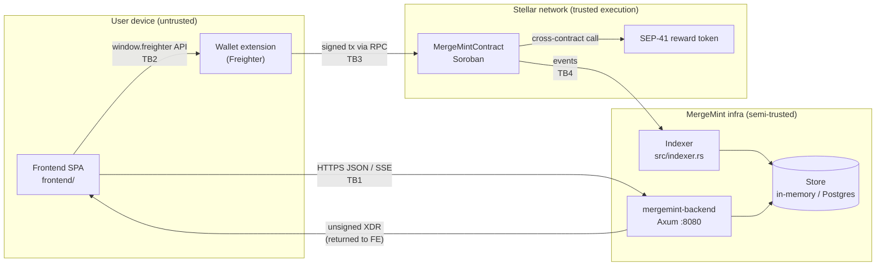

# MergeMint Threat Model (STRIDE)

**Status:** Draft, for maintainer review
**Last reviewed against code:** 2026-09-25, `main` @ `4838d2f`
**Companion docs:** [security.md](security.md) (catalogue of attack vectors and
fixes), [contract-reference.md](contract-reference.md),
[architecture.md](architecture.md#lifecycle-diagram-mermaid),
[backend API guide](../mergemint-backend/docs/api.md)

`security.md` lists individual vulnerabilities and their fixes. This document
takes a **structured** view instead. It maps the system's components and trust
boundaries, then applies STRIDE to each one:

| Letter | Threat | Property violated |
|---|---|---|
| **S** | Spoofing | Authentication |
| **T** | Tampering | Integrity |
| **R** | Repudiation | Non-repudiation / auditability |
| **I** | Information disclosure | Confidentiality |
| **D** | Denial of service | Availability |
| **E** | Elevation of privilege | Authorization |

Each threat has an ID (`C-` contract, `B-` backend, `F-` frontend, `W-`
wallet), a severity on the [security.md scale](security.md#severity-scale),
its current mitigations, and a status:

- ✅ **Mitigated**: enforced in code today
- ⚠️ **Partial**: some controls exist, but there is residual risk
- ❌ **Open**: no effective control; needs a fix or an explicit risk acceptance

---

## 1. System overview

### Trust boundaries

| ID | Boundary | What crosses it |
|---|---|---|
| TB1 | Browser ↔ backend | REST requests, SSE stream, unsigned XDR payloads |
| TB2 | Page ↔ wallet extension | XDR to sign, network name, public key |
| TB3 | Wallet ↔ Stellar RPC ↔ contract | Signed envelopes and Soroban auth entries |
| TB4 | Contract events ↔ indexer | `bounty_*`, `reward_paid`, `dispute_resolved`, … |
| TB5 | Contract ↔ token contract | `balance` probe and `transfer` calls |

### Assets

| Asset | Where it lives | Why it matters |
|---|---|---|
| Reward tokens held by the contract | Token balance of the contract address | Direct financial loss |
| Bounty status and assignees | Contract persistent storage | Decides who gets paid |
| Contributor reputation / `total_earned` | Contract persistent storage | Gates `min_reputation` claims and signals trust |
| User signing keys | Wallet (never the app) | Full account compromise |
| Idempotency and rate-limit state | Backend memory | Exactly-once tx building and abuse control |
| Off-chain index | Backend store | What users see; can drift from the chain |

### Actors

| Actor | Trust | Capabilities |
|---|---|---|
| Bounty creator | Untrusted | Creates, cancels and disputes their own bounties. **Acts as the arbitrator** in its own disputes. |
| Contributor / assignee | Untrusted | Claims, disputes. |
| Verifier | Untrusted | Any non-assignee address, or a listed `required_verifiers` member. |
| Anonymous caller | Untrusted | Any public query, `expire_bounty`, every backend route. |
| Operator | Trusted | Deploys the contract and backend, and funds the contract. |
| Malicious extension / phishing site | Hostile | Runs in the user's browser. |

---

## 2. Contract (`src/contract/`)

### Key findings

Two design facts drive most of the contract risk:

1. **Pooled, unaccounted escrow.** `create_bounty` does **not** transfer
   `reward_amount` into the contract, yet `complete_bounty`,
   `complete_milestone`, `approve_completion`, `cancel_bounty`,
   `expire_bounty` and `resolve_dispute("cancel")` all transfer **out of the
   contract's balance**. Nothing links a bounty to the funds that back it. The
   test suite funds the contract by minting straight to it
   (`src/test.rs`, `token_admin.mint(&contract_id, …)`).
2. **The verifier role is unconstrained.** The only restriction on
   `complete_bounty` is that the verifier must not be an assignee. The payout
   now comes from the contract rather than the verifier's wallet, so the
   collusion analysis in [security.md #1](security.md#1-verifier-collusion)
   (which assumes the verifier pays) no longer holds.

### STRIDE table

| ID | STRIDE | Threat | Sev. | Current controls | Status |
|---|---|---|---|---|---|
| C-S1 | S | Calling a mutation as someone else | High | `require_auth()` on the principal of every mutation. It is the first statement everywhere except `create_bounty` (see C-S2). The [audit](security.md#require_auth-placement-audit) marked `create_bounty` as passing, but that is no longer accurate. Soroban auth entries are nonce-protected against replay. | ✅ |
| C-S2 | S | `create_bounty` runs validation and a cross-contract `balance` probe **before** `creator.require_auth()` | Low | The probe is read-only, and a failed auth rolls everything back. | ⚠️ Inconsistent with the security.md rule. Move the auth call first. |
| C-T1 | T | **Escrow drain through a fake bounty.** An attacker calls `create_bounty(reward_amount = X, reward_token = funded token)` without depositing anything, then `cancel_bounty`. The contract refunds `X` from the pooled balance to the attacker. `expire_bounty` and `resolve_dispute("cancel")` give the same result. | **Critical** | None. The reward is only checked against `MIN_REWARD_AMOUNT`. | ❌ Pull `reward_amount` from the creator in `create_bounty`, and track a per-token escrow ledger. |
| C-T2 | T | **Self-payout through a sock-puppet verifier.** An assignee completes their own bounty from a second address, and the contract pays them from the pooled balance. Combined with C-T1, a bounty creator can also route pool funds to an accomplice. | **Critical** | `VerifierCannotBeAssignee` only compares addresses. | ❌ Restrict the verifier to the creator or `required_verifiers`, and fund payouts from the bounty's own escrow. |
| C-T3 | T | **Repeat payout via `approve_completion`.** On the multi-verifier path, `status` is never checked. After the bounty reaches `completed`, each remaining listed verifier who has not voted can call it again. `approval_count >= threshold` still holds, so `distribute_payout` runs again. | High | `AlreadyApproved` stops the *same* verifier from voting twice. | ❌ Add `ensure_status(in_progress)` and clear approvals on completion. |
| C-T4 | T | **Bypassing dispute arbitration via `approve_completion`.** The same missing guard lets listed verifiers complete (and pay out) a `disputed` bounty, or a `cancelled` one that still has assignees after `resolve_dispute("cancel")`. That second case refunds the creator *and* pays the assignees. | High | None on this path. `complete_bounty` does check `BountyIsDisputed`. | ❌ Same fix as C-T3. |
| C-T5 | T | Double completion through `complete_bounty` | High | `BountyNotInProgress` guard, and the status is written before transfers (see [security.md #5](security.md#5-double-completion-reward-drain-via-repeated-complete_bounty)). | ✅ |
| C-T6 | T | Reentrancy from the token contract | Low | Soroban does not allow re-entry into a contract that is already on the call stack. `complete_bounty_inner` follows checks-effects-interactions. `approve_completion` and `complete_milestone` transfer before persisting state. | ⚠️ Low today. Keep checks-effects-interactions in all payout paths. |
| C-T7 | T | Malicious `reward_token` (a contract that passes the `balance` probe but misbehaves on `transfer`) | Medium | `validate_reward_token` probes `balance`. The backend has `ALLOWLISTED_REWARD_TOKENS`, but the contract does not enforce it. | ⚠️ Consider an on-chain token allow-list. |
| C-T8 | T | Milestone arithmetic: sum overflow, or a mismatch with `reward_amount` | Medium | `checked_add`, `RewardAmountOverflow`, `MilestoneRewardsMismatch`. | ✅ |
| C-T9 | T | Rounding dust: `reward × share_bp / 10_000` truncates, so the dust stays in the pool | Low | The first assignee gets the remainder basis points, but not the token-unit remainder. | ⚠️ Accept, or sweep the dust to the first assignee. |
| C-R1 | R | `resolve_dispute` emits only `dispute_resolved`, not `bounty_completed` / `bounty_cancelled`. Indexers that key off those events miss the transition. | Medium | The event includes `resolution`. | ⚠️ Document it for indexers (done in contract-reference.md), or emit both events. |
| C-R2 | R | `update_contributor_metadata` emits no event, so profile changes cannot be audited off-chain | Low | None | ❌ Add a `metadata_updated` event. |
| C-R3 | R | `complete_milestone` and `approve_completion` have no status or event trail explaining *why* funds moved when combined with C-T3/C-T4 | Medium | `reward_paid` and `approval_recorded` events | ⚠️ |
| C-I1 | I | All bounty data, assignees, reputations and metadata are public on-chain | Low | Inherent to the design. Nothing secret is stored. | ✅ Accepted. |
| C-I2 | I | `BountyMeta` is kept in **temporary** storage and can expire, so titles and descriptions disappear from the chain | Low | The indexer keeps an off-chain copy. | ⚠️ Accepted. Document the TTL. |
| C-D1 | D | **Claim squatting.** A contributor claims a single-assignee bounty and never delivers. The creator cannot `cancel_bounty` (it is not `open`), and `expire_bounty` also requires `open`. The only exit is dispute, then `resolve_dispute("cancel")`. | Medium | The dispute path exists. `ContributorHasActiveClaim` limits each squatter to one bounty. | ⚠️ Allow expiry or unassignment of stale `in_progress` claims. |
| C-D2 | D | Unbounded scans in `get_bounties_by_tag` and `get_contributor_active_bounty` exceed the CPU budget as the index grows | Medium | The status and open indexes are paged (`PAGE_SIZE`). These two queries still read the full list. | ⚠️ Paginate them. |
| C-D3 | D | Index spam: creating many cheap bounties (≥ 100 units, **no deposit**) bloats the open and status indexes | Medium | `MIN_REWARD_AMOUNT = 100` | ❌ This effectively costs nothing until C-T1 is fixed. |
| C-D4 | D | Stuck funds: a bounty that cannot reach a terminal state leaves its escrow locked | Medium | Cancel, expire and dispute exits exist, but see C-D1. | ⚠️ |
| C-E1 | E | **The creator is judge in their own dispute.** They can dispute an `in_progress` bounty after the work is delivered, then `resolve_dispute("cancel")` to refund themselves. | High | The arbitrator must meet `min_reputation`, and `raise_dispute` is limited to the creator or an assignee. | ❌ Introduce an independent arbitrator or admin role, or a timelock that lets the assignee respond. |
| C-E2 | E | Reputation farming: +10 per completion, no deposit, and sock-puppet verifiers (C-T2) make reputation almost free, which defeats `min_reputation` gating | Medium | `active_claims ≤ 1` and `CreatorCannotClaim` | ❌ Depends on the C-T1/C-T2 fixes. |
| C-E3 | E | A contributor claiming their own bounty | Medium | `CreatorCannotClaim` guard | ✅ |
| C-E4 | E | A verifier approving their own work | High | `VerifierCannotBeAssignee` in `complete_bounty`, `complete_milestone` and `approve_completion` | ✅ (but see C-T2) |

---

## 3. Backend (`mergemint-backend/`)

The backend is a **helper, not an authority**. It builds unsigned XDR and
serves an index, and every state change must still pass the on-chain guards.
Its compromise therefore affects availability and integrity of the *view*,
and can trick users into signing, but it cannot move funds by itself.

| ID | STRIDE | Threat | Sev. | Current controls | Status |
|---|---|---|---|---|---|
| B-S1 | S | **No authentication on any route.** `POST /tx/resolve-dispute` trusts a body-supplied `arbitrator`, and `POST /tx/self-claim` a body-supplied `claimant`. | Medium | The contract re-checks everything on-chain, and the returned XDR is unsigned. | ⚠️ Acceptable only while routes stay XDR builders. Add SEP-10 auth before any route submits transactions or writes state. |
| B-S2 | S | `POST /bounties/:id/claim` lets anyone broadcast fake `bounty_updated` SSE events for any ID | Low | Clients should refetch rather than trust the payload. | ❌ Authenticate the route, or drive the stream from the indexer only. |
| B-S3 | S | A client-supplied `x-request-id` is trusted and echoed, so logs can be seeded with confusing or forged correlation IDs | Low | The value is a header, so CRLF injection is rejected by `http`. | ⚠️ Prefix or validate it (for example, UUID-only). |
| B-T1 | T | A compromised or MITM'd backend returns malicious XDR (a different destination, amount or contract) | High | HTTPS in deployment. The wallet shows transaction details. | ⚠️ See W-T1. The frontend should decode and verify the XDR before signing. |
| B-T2 | T | **Global idempotency keys.** Keys are not scoped to route, user or body, so a reused or guessed key replays another request's cached response | Medium | Keys are expected to be random UUIDs. | ⚠️ Scope keys per route and principal, hash the body, and reject mismatches with `422`. |
| B-T3 | T | Off-chain index drift: the indexer misses or misreads events such as C-R1, so the UI shows the wrong status | Medium | Horizon polling, reconnect tests | ⚠️ |
| B-R1 | R | Only `resolve_dispute` is audit-logged. `self_claim` outcomes and rate-limit rejections are not. | Low | `tracing` with request IDs | ⚠️ Add structured audit logs for `self_claim`. |
| B-I1 | I | Internal error details leak in responses | Medium | 5xx bodies are always redacted, and 4xx messages containing `SENSITIVE_MARKERS` are redacted too. | ✅ |
| B-I2 | I | Idempotency replay returns a cached body to anyone who presents the key (B-T2) | Low | Bodies contain no secrets today, only unsigned XDR. | ⚠️ |
| B-I3 | I | Cross-origin reads by hostile sites | Medium | CORS allow-list (`CORS_ALLOWED_ORIGINS`); empty means nothing is allowed | ✅ |
| B-D1 | D | Oversized bodies and slow clients | Medium | 1 MiB `RequestBodyLimitLayer`, 30 s `TimeoutLayer` | ✅ |
| B-D2 | D | **Rate-limit bypass.** The `self_claim` limiter is keyed by the body-supplied `claimant`, so rotating the claimant bypasses it. Other routes are not limited at all. | Medium | 10 requests / 60 s per claimant | ⚠️ Also key on client IP or authenticated principal, and add a global limiter. |
| B-D3 | D | **Unbounded in-memory maps.** The idempotency store and rate-limit buckets never evict, so memory grows with unique keys and claimants. | Medium | None | ❌ Add TTL eviction, or move them to Redis (already noted in the `AppState` docs). |
| B-D4 | D | SSE connection exhaustion: every subscriber holds a connection with no cap per client | Medium | The broadcast buffer is bounded (100). Slow consumers skip events. | ⚠️ Cap connections at the proxy. |
| B-E1 | E | No admin or privileged routes exist | — | — | ✅ Nothing to escalate to today. |

---

## 4. Frontend (`frontend/`, canonical per [ADR-0001](adr-0001-frontend-canonical-directory.md))

| ID | STRIDE | Threat | Sev. | Current controls | Status |
|---|---|---|---|---|---|
| F-S1 | S | Phishing clone of the dApp that asks the user to sign malicious transactions | High | None app-side. Wallet domain display. | ⚠️ Publish canonical domains and contract IDs, and use contract-ID pinning in the UI. |
| F-S2 | S | Building against the wrong network or contract (`VITE_NETWORK`, `VITE_API_BASE_URL` misconfigured) | Medium | `NetworkMismatchBanner` / `useNetworkMismatch` compares the wallet network to `CONFIGURED_NETWORK`. | ⚠️ Also pin the contract ID per network. |
| F-T1 | T | **Blind signing.** `lib/wallet.ts#signTransaction` forwards backend-supplied XDR to the wallet without decoding it or checking the contract, function or args | High | The wallet's own confirmation screen | ❌ Decode the XDR client-side and assert the contract ID, function and args match the user's intent. |
| F-T2 | T | Stored XSS through bounty titles, descriptions or contributor `metadata` rendered in the UI | Medium | React escapes text by default. No `dangerouslySetInnerHTML` in `frontend/src`. | ✅ Keep it that way, and add a CSP. |
| F-T3 | T | Supply-chain compromise of npm dependencies | High | Lockfile | ⚠️ Pin versions, use `npm audit` in CI, and SRI for any CDN assets. |
| F-R1 | R | Optimistic UI (`useTxFlow`) shows success before confirmation, so users may dispute what they saw | Low | `buildFailedState` rolls back. The explorer link shows the truth. | ✅ |
| F-I1 | I | Wallet address correlation across sessions and third-party analytics | Low | No analytics found in `frontend/src`. | ✅ |
| F-D1 | D | Fake SSE events (B-S2) trigger refetch storms | Low | Handlers refetch rather than trust the payload. | ⚠️ Debounce refetches. |
| F-E1 | E | Client-side role checks (for example, showing "Resolve" only to the creator) are bypassable | — | By design: every authoritative check is on-chain. | ✅ Accepted. |

---

## 5. Wallet interactions (Freighter today; passkey smart wallets [planned](passkey-auth.md))

| ID | STRIDE | Threat | Sev. | Current controls | Status |
|---|---|---|---|---|---|
| W-S1 | S | **A spoofed `window.freighter`.** Another extension or injected script defines the object and intercepts `signTransaction` or returns a fake address. | High | None. `isFreighterInstalled` only checks `'freighter' in window`. | ❌ Use the official `@stellar/freighter-api` package (message-based, origin-checked) instead of the raw global. |
| W-S2 | S | The user connects the wrong account and acts as an unintended principal | Low | `require_auth` binds the action to the signing address. | ✅ |
| W-T1 | T | Signing a transaction whose contents differ from what the UI showed (see F-T1, B-T1) | High | The Freighter confirmation screen | ⚠️ Pair it with the F-T1 fix. |
| W-T2 | T | **Over-broad Soroban auth entries.** `resolve_dispute("complete")` requires the arbitrator to authorize a sub-invocation `token.transfer(arbitrator → assignee, payout)`, and users may not notice the token spend. | Medium | Soroban auth entries are scoped to the exact invocation tree and nonce. | ⚠️ Show the token-spend amount explicitly in the UI before signing. |
| W-T3 | T | Network confusion: signing a testnet transaction on mainnet or the reverse | Medium | The network passphrase is part of the signature payload, and there is a mismatch banner. | ✅ |
| W-R1 | R | A user denies having performed an action | Low | Signed envelopes and auth entries are on-chain proof. | ✅ |
| W-I1 | I | The public key is revealed to every site the user connects | Low | Inherent. `requestAccess` needs user consent. | ✅ Accepted. |
| W-D1 | D | Wallet missing, locked or unresponsive, which blocks all mutations | Low | Clear "not installed" errors | ✅ |
| W-E1 | E | Replaying a signed auth entry in another transaction | High | Soroban nonces and signature-expiration ledgers | ✅ |
| W-E2 | E | (Passkey, planned) a fee-sponsoring relayer submits user-signed auth entries and could censor or reorder them | Medium | Not implemented yet | ⚠️ Revisit when the relayer lands. |

---

## 6. Prioritised remediation

| Priority | Threats | Action |
|---|---|---|
| **P0** | C-T1, C-T2, C-D3, C-E2 | Make escrow real: transfer `reward_amount` from the creator in `create_bounty`, track per-bounty funds, and restrict who may act as verifier. |
| **P0** | C-T3, C-T4 | Add `ensure_status(in_progress)` to `approve_completion` and clear approvals once the bounty completes. Add regression tests for approving after completion, after a dispute and after cancellation. |
| **P1** | C-E1, C-D1 | Add an independent arbitration path, and an exit for stale `in_progress` claims. |
| **P1** | F-T1, W-S1, W-T1, B-T1 | Decode and verify XDR before signing, and switch to `@stellar/freighter-api`. |
| **P2** | B-D2, B-D3, B-T2 | Evict entries from the in-memory stores, and scope idempotency keys and rate limits to a principal. |
| **P2** | C-R1, C-R2, B-R1 | Close the event and audit-log gaps. |
| **P3** | C-S2, C-D2, B-S2, B-S3 | Hygiene fixes. |

## 7. Review checklist for maintainers

- [ ] Confirm or reject the **Critical** contract findings (C-T1, C-T2), ideally
      by adding failing tests in `src/test.rs` that reproduce them.
- [ ] Confirm the intended escrow model and update [security.md](security.md)
      so its no-escrow assumptions match the current payout-from-contract code.
- [ ] Decide which ⚠️ items are accepted risks, and record the owner and date.
- [ ] Re-run this model when any of these change: a new mutation, the escrow
      design, a backend route that submits transactions, or the wallet
      integration (passkeys).
